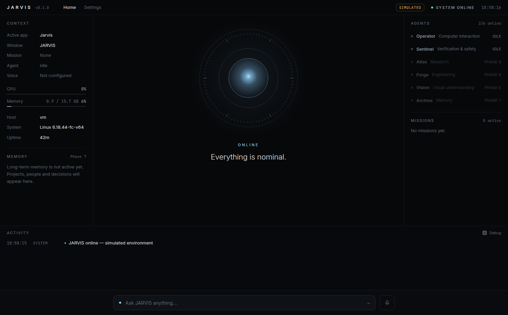
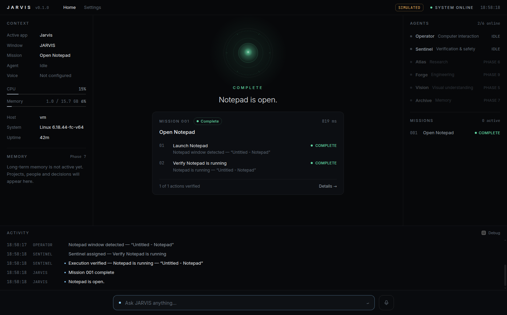
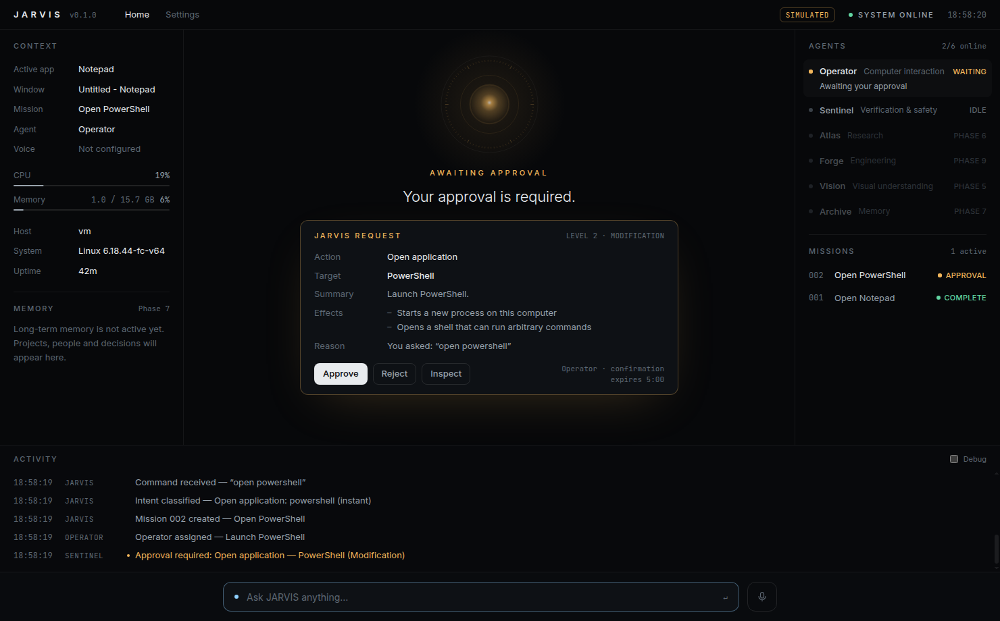
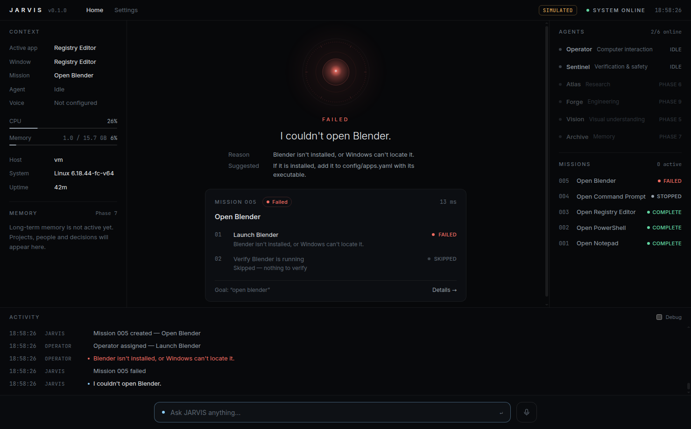

# JARVIS

A personal intelligence operating system: one coherent intelligence between you
and your computer that understands, plans, delegates, acts, **verifies** and
reports — with every step visible in a calm command center.

**Status:** Phase 1 (Foundation) complete — see [ROADMAP.md](ROADMAP.md) and
[docs/IMPLEMENTATION_STATUS.md](docs/IMPLEMENTATION_STATUS.md).

```
"Open Notepad."
 → intent classified → Mission 001 → Operator launches Notepad (observed before/after)
 → Sentinel re-observes independently → verified → "Notepad is open."
```

| Idle | Verified action |
|---|---|
|  |  |
| **Approval request** | **Failure, explained** |
|  |  |

_Screenshots from the Electron E2E run (simulated desktop on Linux)._

## What works today

- **Desktop command center** (Electron + React): JARVIS Core visual with explicit
  states, active mission with live steps, approval requests, context, agents,
  missions, activity stream, command bar, mission detail, settings.
- **Backend** (FastAPI): event bus + WebSocket stream, state service, router,
  missions with pause/resume/stop, Operator + Sentinel agents, tool framework,
  permission levels 0–4 with approvals, SQLite persistence, audit log,
  structured JSON logs with trace/mission ids.
- **Real system control on Windows and macOS**: `open_application` (launch,
  window/process observation before and after, independent verification),
  `get_active_window`, `list_running_apps`, `get_system_info`.
  - Windows: ShellExecute, EnumWindows/DWM, UWP-aware.
  - macOS: `open -a` (LaunchServices), CGWindowList + bundle-aware process
    detection. No privacy permission needed; with Screen Recording allowed,
    window titles of other apps become visible too.
- **Commands**: `open <app>` / `open <app> and <app>` (also German *öffne*,
  *starte*), `what's the active window`, `list running apps`, `system status`,
  `hello`, `help`. Anything else gets an honest "needs model integration" reply.

On other hosts (Linux) the desktop is **simulated** (clearly badged in the UI);
CPU/RAM/host metrics are always real.

## Requirements

- Windows 10/11 or macOS, Python **3.12+**, Node.js **20+**

## Setup & run (Windows)

```powershell
git clone https://github.com/valeriohartmann777-jpg/Valerio-OS C:\dev\Valerio-OS
cd C:\dev\Valerio-OS\jarvis          # or copy this folder to C:\dev\jarvis
powershell -ExecutionPolicy Bypass -File scripts\setup.ps1
npm run dev
```

`npm run dev` starts Vite and Electron; Electron starts the Python backend from
`backend\.venv` automatically (or reuses one already running on port 8765) and
stops it when you quit.

Production-style run (built renderer served over `app://`):

```powershell
npm start
```

Backend only (e.g. for API work): `backend\.venv\Scripts\python -m jarvis`
→ http://127.0.0.1:8765/docs

Try the real system tool without the UI:

```bash
backend/.venv/bin/python scripts/smoke.py textedit          # macOS
backend\.venv\Scripts\python scripts\smoke.py notepad        # Windows
```

## Setup & run (macOS / Linux)

macOS ships Python 3.9; install a current one first (`brew install python@3.13`
or the installer from python.org).

```bash
git clone -b claude/jarvis-foundation-mxnsz4 https://github.com/valeriohartmann777-jpg/Valerio-OS.git ~/dev/Valerio-OS
cd ~/dev/Valerio-OS/jarvis
./scripts/setup.sh && npm run dev
```

On macOS JARVIS controls the real desktop: `open textedit`, `open safari`,
`öffne den rechner`, `open spotify`, `open terminal` (asks for approval), or any
installed app by name. Commands: `what's the active window`, `list running apps`.

## Tests

```bash
scripts/check.sh                      # ruff, mypy (+win32), pytest, typecheck, vitest
npm run build && npm run test:e2e     # drives the real Electron app (xvfb-run -a on Linux)
```

## Layout

```
apps/desktop/        Electron main (electron/) + React renderer (src/)
backend/jarvis/      api · core · missions · agents · tools · permissions · events · storage · observability
packages/protocol/   typed event/API contract shared with the UI
config/              jarvis · permissions · personality · apps · models (.yaml)
docs/                implementation status
scripts/             setup, dev, checks, real-system smoke test
tests/e2e/           Electron end-to-end test
data/                SQLite + logs at runtime (git-ignored)
```

Architecture: [ARCHITECTURE.md](ARCHITECTURE.md) · Decisions: [DECISIONS.md](DECISIONS.md)

## Configuration

- `config/jarvis.yaml` — server, runtime timings, storage
- `config/permissions.yaml` — policy per level, overrides, disabled categories
- `config/apps.windows.yaml`, `config/apps.macos.yaml` — application catalogs
  (aliases incl. German, launch targets, process names, risk level)
- `config/personality.yaml` — tone and reply templates
- `config/models.yaml` — provider slots for Phase 3
- `.env` — overrides and (later) API keys; see `.env.example`
